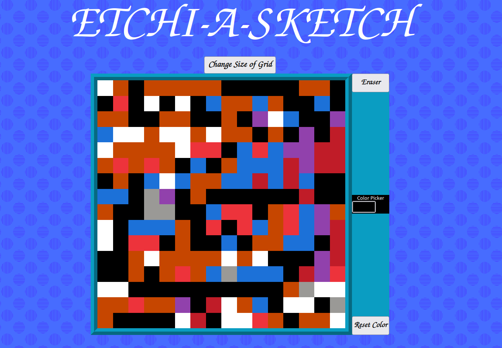

# Etch A Sketch

This is a simple web application that allows you to draw and erase using your mouse, just like an Etch A Sketch toy. You can also change the size of the drawing area and the color of the pen.

## How to use

1. Open the `index.html` file in your web browser.
2. Move your mouse over the drawing area (white squares).
3. Press and hold the left mouse button to draw.
4. To erase, click the eraser button.
5. To change the size of the drawing area, click the "Change Size" button and enter a      number between 1 and 40.
6. To change the color of the pen, click the color picker button and select a color.
7. To reset the drawing area, click the "Reset" button.

## How it works

The application is built using HTML, CSS, and JavaScript. The drawing area is created using a grid of div elements, and the color and size of the grid can be changed using JavaScript. Mouse events are used to detect when the mouse is clicked and dragged over the drawing area, and the color of the divs is changed accordingly. The eraser button changes the color of the divs back to white. The color picker button opens a color picker dialog where the user can select a color. The reset button changes the color of all the divs back to white and resets the color picker to black.

## Credits

This application was created by [Arslan Haider].